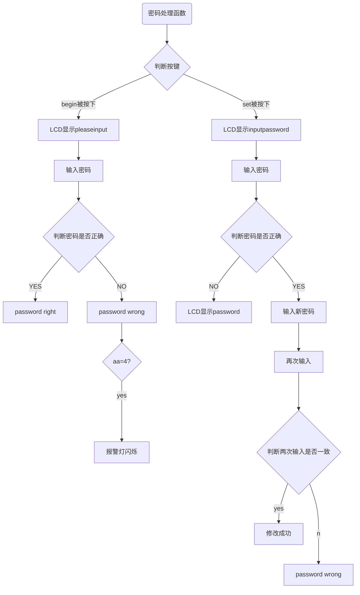
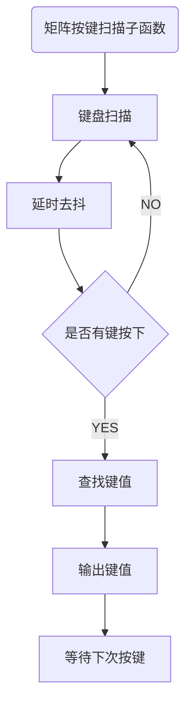
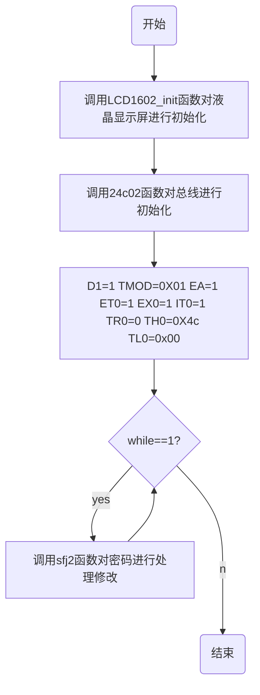
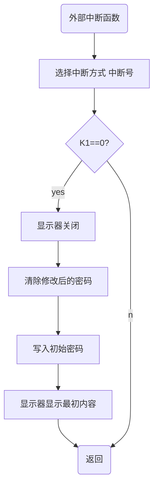
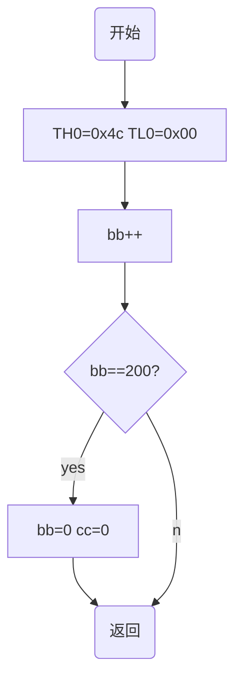

## 智能电子锁

基于51芯片开发的简易六位密码锁

### 1.基本功能介绍

- [x] 能够从键盘中输入密码，并相应地在显示器上显示"*"

-  [x] 能够判断密码是否正确，正确则开锁，错误则输出相应信息
-  [x] 能够实现密码的修改
-  [x] 断电或者单片机复位后能够保存之前的操作，比如密码的修改
-  [x] 在操作错误到达一定次数后能够报警
-  [x] 备用密码我们改为，初始密码，在功能上实用性更强，利用中断按钮清除用户密码，恢复初始密码

### 2.所需硬件资源

- 安装Keil C51
- AT89C51
- 蜂鸣器
- LCD1602液晶显示屏
- 制作矩阵键盘

### 3.硬件整体架构

> 用Word画的硬件示意图位于包含本文件的文件夹

### 4.程序流程图展示

####                     4.1 密码处理函数流程示意图

####                          4.2    矩阵键盘工作流程图 

####                    4.3 LCD1602工作流程

####           4.4外部中断函数流程图

####           4.5定时器中断子函数

### 5.外部按钮

复位按钮按下或断电重启后，单片机重新初始化，密码不发生变化，做到断电不丢失。

中断按钮按下后，用户密码清除，恢复初始密码，方便用户忘记密码后，重设密码

### 6.操作密码说明

初始密码和管理员密码都为六位密码080808

### 7.致谢

刘老师给与了我们最大的关心和支持，给我们提供了良好的学习场地和充足的耐心。

还有郑老师，文老师，杨老师珍贵的指导意见。

为了保护各位老师和同学的隐私，不再显示全名

### 关于作者

> 黄同学        
>
> 袁同学    
>
> 王德泉    